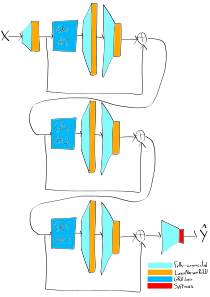
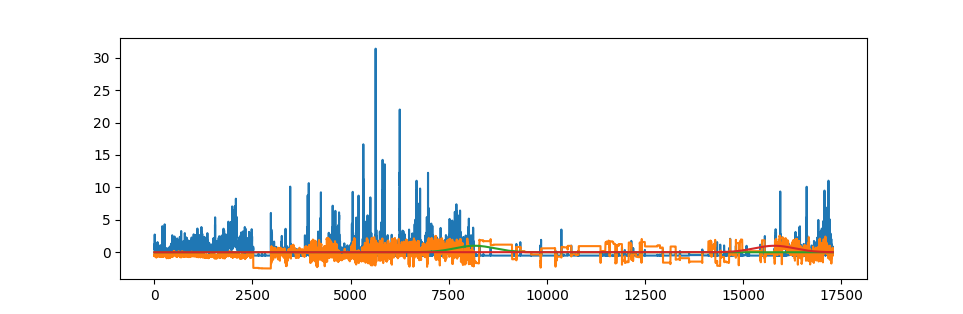

# Kaggle_Sleep_Detection
по данным с акселерометра(ещё был дан угол между телом и рукой в конкретный промежуток времени) нужно было сказать когда человек заснёт и когда проснется. Мы решали задачу как сегментацию перехода из состояний сна и бодрствования, например: в 1 time series был момент когда человек заснул и проснулся и мы делаем 2 TS(1 для wakeup и другой для onset) в которых хранятся переходы из состояний в виде гауссиан, где центр гауссианы это время в котором был wakeup/onset.
Дальше TS с акселерометра и с углом и подавали в 5 последовательных BiGRU со skip connection, получали эмбеддинги разворачивали их до входной размерности TS через transposed convolution 

